# Pyi-thon

<p align="center">
  <strong>Learn Python by writing real code. 30 levels. Zero setup. Completely free.</strong>
</p>

<p align="center">
  <a href="https://pyithon.com"></a>
</p>

<p align="center">
  <a href="https://github.com/aiedwardyi/pyi-thon/actions/workflows/ci.yml"></a>
  
  
  
  
  
  
</p>

---

Pyi-thon is a browser-first Python learning platform built for people who learn best by doing. There is no Python install, no terminal setup, and no dependency rabbit hole - just open the app and start writing code.

It is aimed at complete beginners, but it is also friendly to experienced developers who want a clean, inspectable open source project with a real product feel.

<p align="center">
  <a href="https://pyithon.com"><strong>Try it now &rarr;</strong></a>
</p>

<p align="center">
  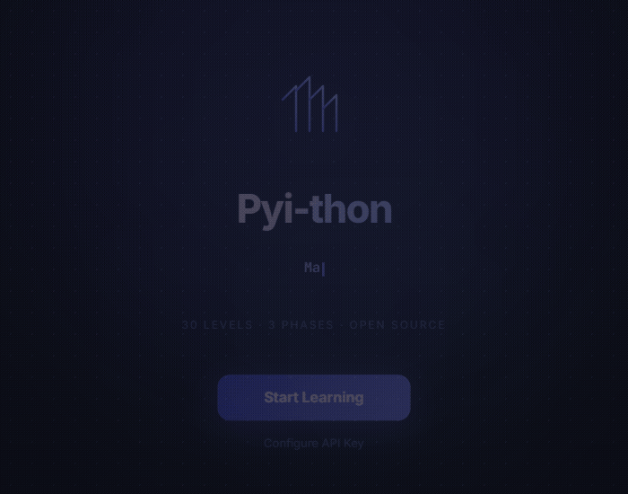
</p>

## Why Pyi-thon?

Most Python tutorials make you read. Pyi-thon makes you write.

- No copy-paste - you type every line yourself
- No autocomplete - you actually learn the syntax
- Instant feedback - know if you're right in seconds
- Works offline - Python runs in your browser via WebAssembly
- Gamified - XP, streaks, confetti, and sound effects keep things moving
- Free and open source - fork it, customize it, self-host it

## Screenshots

<table>
  <tr>
    <td align="center"><strong>Code Editor (Dark)</strong></td>
    <td align="center"><strong>Korean + Light Mode</strong></td>
  </tr>
  <tr>
    <td>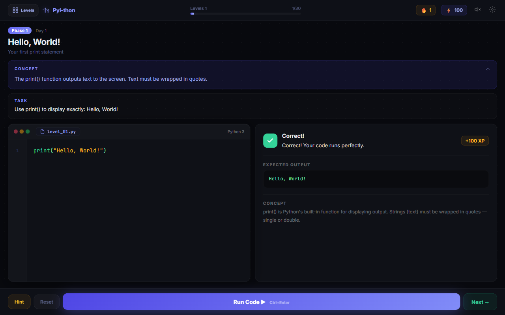</td>
    <td>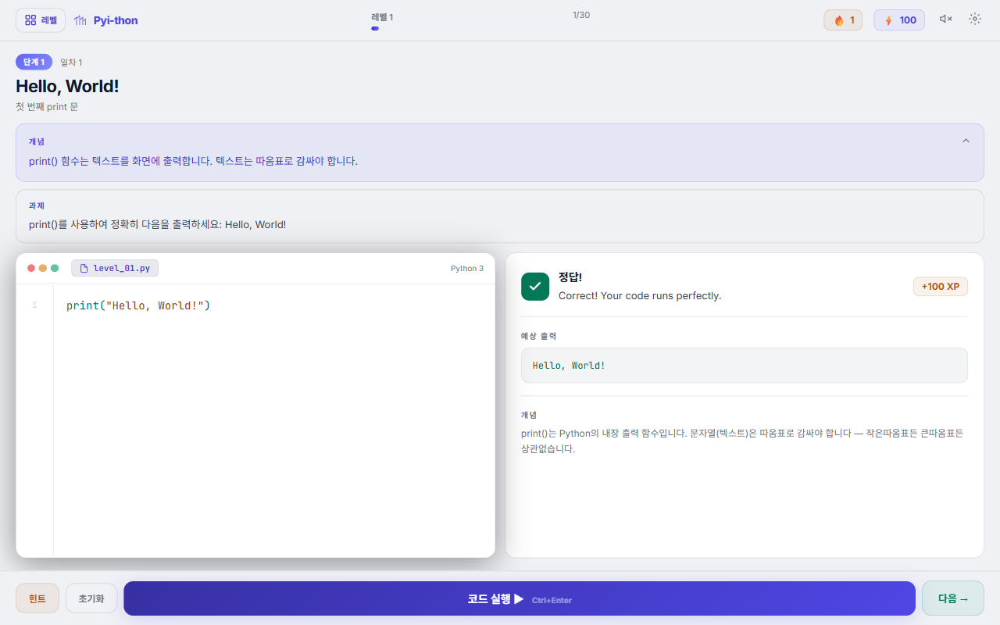</td>
  </tr>
  <tr>
    <td align="center"><strong>Level Select</strong></td>
    <td align="center"><strong>Settings &amp; AI Providers</strong></td>
  </tr>
  <tr>
    <td>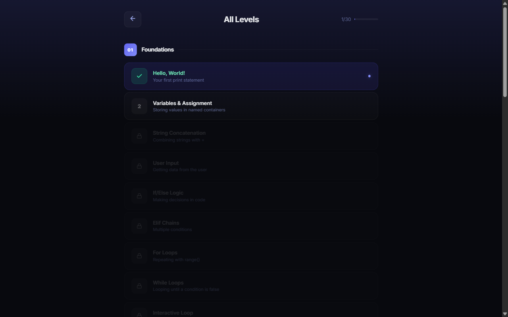</td>
    <td>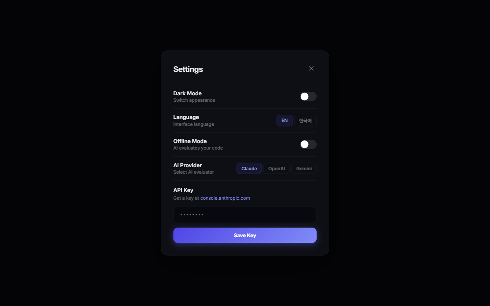</td>
  </tr>
  <tr>
    <td align="center" colspan="2"><strong>Mobile</strong></td>
  </tr>
  <tr>
    <td align="center" colspan="2">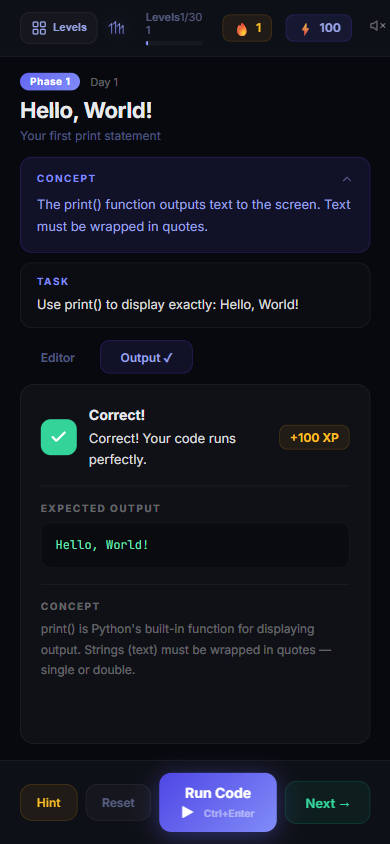</td>
  </tr>
</table>

## Themes

Seven built-in themes, all available from Settings.

<table>
  <tr>
    <td align="center">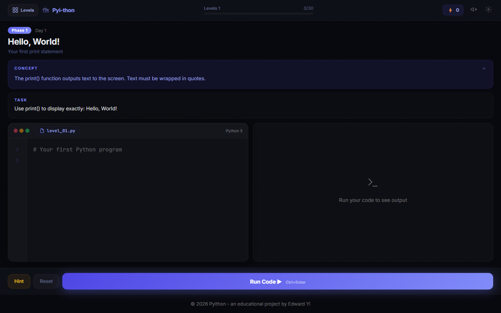<br /></td>
    <td align="center">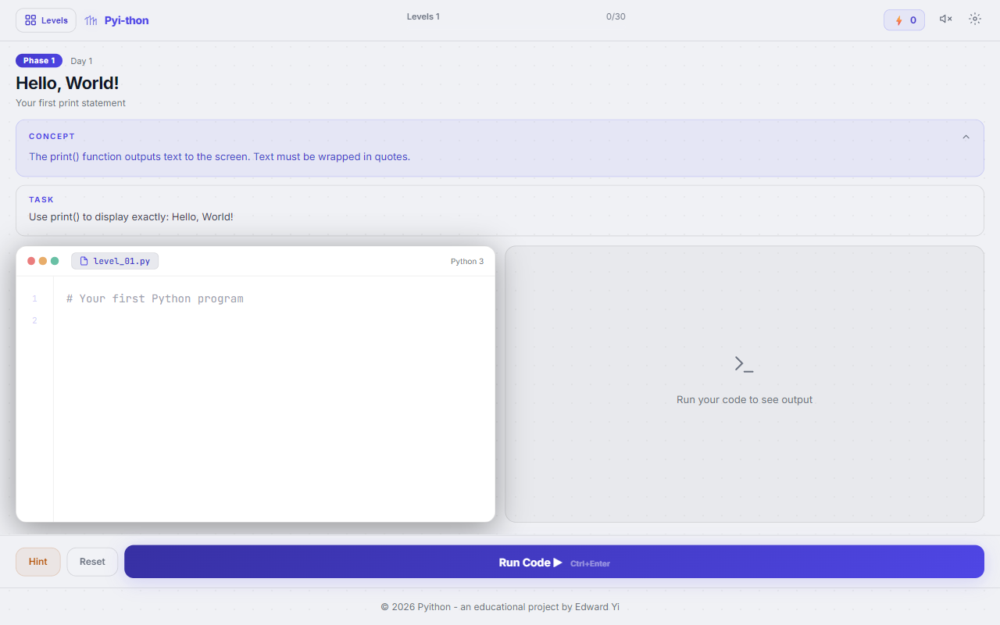<br /></td>
    <td align="center">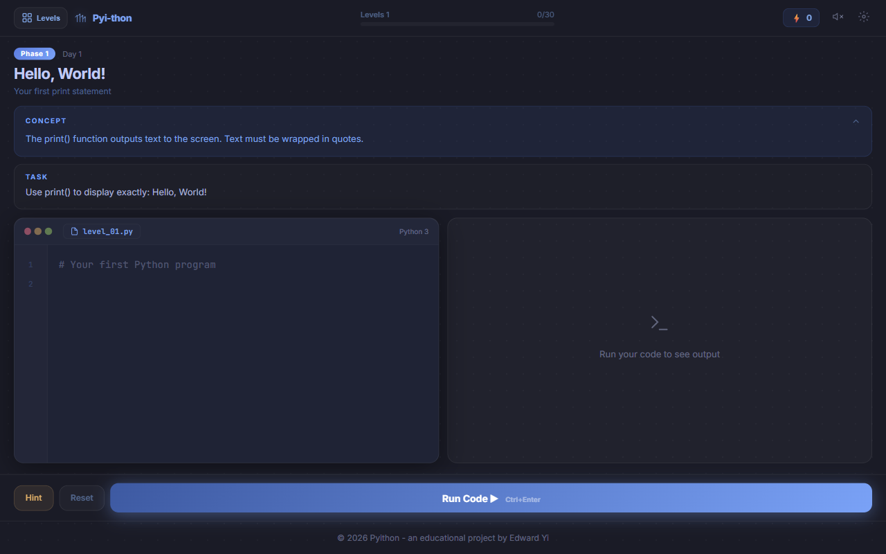<br /></td>
  </tr>
  <tr>
    <td align="center">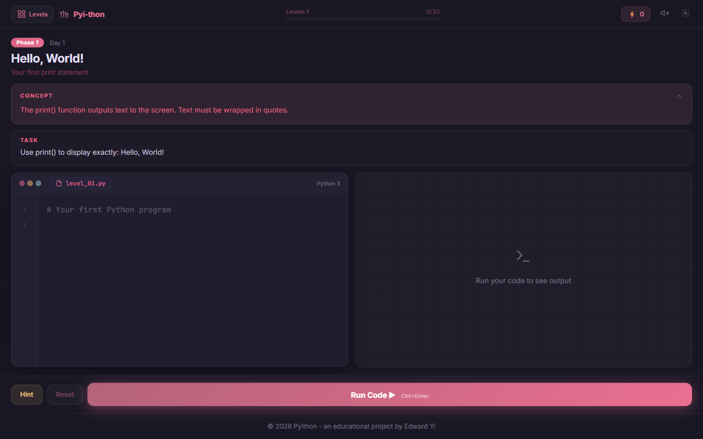<br /></td>
    <td align="center">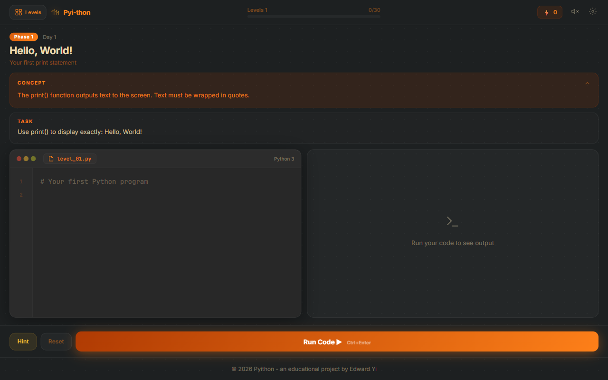<br /></td>
    <td align="center">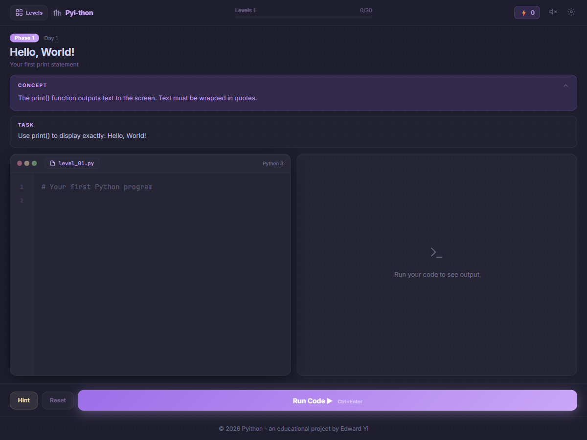<br /></td>
  </tr>
  <tr>
    <td align="center">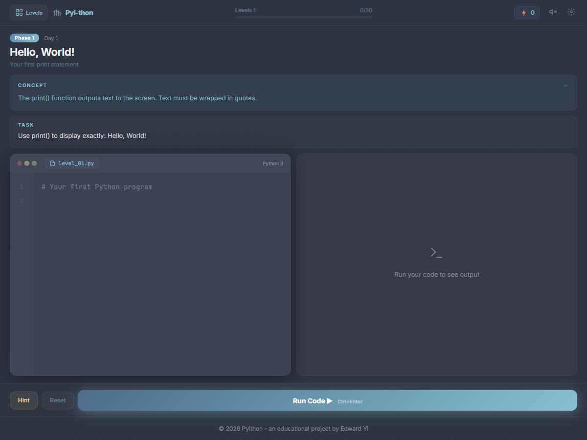<br /></td>
    <td align="center" colspan="2"></td>
  </tr>
</table>

## Features

| Feature | Description |
|---------|-------------|
| **30 Progressive Levels** | From `print("Hello")` to data pipelines across 3 phases |
| **Real Python in Browser** | Pyodide (WebAssembly) runs actual Python 3 - no server needed |
| **AI-Powered Evaluation** | Claude, OpenAI, or Gemini analyze your code and accept creative solutions |
| **Offline Mode** | Works completely offline with Pyodide - no API key required |
| **Bilingual** | Full English and Korean (한국어) interface and level content |
| **7 Themes** | Dark, Light, Tokyo Night, Love, Gruvbox, Catppuccin, and Nord |
| **Gamification** | XP system, streak counter, confetti celebrations, sound effects |
| **Syntax Highlighting** | Full Python syntax highlighting in the built-in editor |
| **Progress Saving** | Auto-saves to localStorage - close the tab, come back later |
| **Responsive** | Side-by-side on desktop, tabbed layout on mobile |
| **Zero Dependencies** | React + Vite only. No state library, no CSS framework, no bloat |

## Quick Start

```bash
git clone https://github.com/aiedwardyi/pyi-thon.git
cd pyi-thon
npm install
npm run dev
```

Open the local app at `http://localhost:3000`.

### AI Evaluation (Optional)

Pyi-thon works fully offline out of the box. For smarter AI-powered evaluation, add any one of these:

| Provider | Get a key | Model used |
|----------|-----------|------------|
| **Claude** (default) | [console.anthropic.com](https://console.anthropic.com) | Claude Sonnet |
| **OpenAI** | [platform.openai.com](https://platform.openai.com) | GPT-4o Mini |
| **Google Gemini** | [aistudio.google.com](https://aistudio.google.com) | Gemini 2.0 Flash |

Enter your key in the Settings panel. For public or static deployments, do not put provider secrets into Vite env vars, because `VITE_*` values are embedded into the client bundle.

If you need shared credentials, route AI requests through a server-side proxy instead.

## The 30 Levels

| Phase | Levels | What You Learn |
|-------|--------|---------------|
| **01 - Foundations** | 1-18 | print, variables, strings, input, if/else, loops, functions, lists, dicts |
| **02 - Real Skills** | 19-25 | mini apps, file I/O, error handling, classes, JSON, imports |
| **03 - Beyond** | 26-30 | list comprehensions, string methods, f-strings, lambda/map, data pipelines |

Each level has a concept explanation, a task, a built-in hint, starter code, and a detailed explanation after you solve it.

## How It Works

```
You write Python  ->  Submit  ->  AI or Pyodide evaluates  ->  Feedback + XP
```

Offline mode runs your code through Pyodide and checks the output against expected results. It also verifies you used the right concept, so hardcoded answers do not pass.

For lessons that teach `input()`, offline checks use built-in sample inputs shown in the lesson UI and result panel so the expected output stays reproducible on mobile and desktop.

The URL-driven QA/debug mode is limited to local and dev environments so shared production links cannot auto-run test payloads.

AI mode sends your code to your chosen provider for nuanced evaluation. It accepts creative solutions, different variable names, and alternative approaches, as long as you use the concept being taught.

## Project Structure

```
pyi-thon/
├── index.html          # Entry point + font imports
├── package.json        # Scripts and dependencies
├── vite.config.js      # Dev server config
├── .env.example        # Notes about keeping provider keys out of public builds
└── src/
    ├── main.jsx        # React mount point
    ├── App.jsx         # Application orchestration and lesson flow
    ├── components/     # Focused UI panels and screens
    ├── data/           # App strings, provider config, and level content
    ├── lib/            # Storage and AI evaluation helpers
    └── theme/          # Theme palettes and shared global styles
```

The app stays intentionally lightweight while keeping obvious responsibilities separated so the source is easier to review.

## Tech Stack

| Technology | Purpose |
|-----------|---------|
| **React 18** | UI rendering |
| **Vite 5** | Dev server, build |
| **Pyodide** | Python 3 in the browser (WebAssembly) |
| **Claude / OpenAI / Gemini** | AI code evaluation |
| **Web Audio API** | Sound effects |
| **localStorage** | Progress + preferences |

No other dependencies. No state management library. No CSS framework. No component library. Just React and Vite.

## Quality And Releases

This repo is meant to stay easy to trust, easy to inspect, and easy to ship.

- Quick maintainer check: `npm run smoke`
- Release-ready changes should pass `npm test`, `npm run build`, and `npm run test:e2e`
- Release candidates should also pass `npm run lint`
- UI changes should be checked on both desktop and mobile widths
- Keep PRs focused so reviews stay fast
- Include screenshots for visual changes when it helps reviewers
- Prefer small, understandable releases over big surprise drops

Versioned releases are published from Git tags such as `v1.0.0`, and the repo includes CI plus release automation so the public history stays easy to follow.

See [CHANGELOG.md](CHANGELOG.md), [RELEASE_CHECKLIST.md](RELEASE_CHECKLIST.md), and [ROADMAP.md](ROADMAP.md) for release history, release steps, and project direction.

## Repo Standards

- [Contributing Guide](CONTRIBUTING.md)
- [Code of Conduct](CODE_OF_CONDUCT.md)
- [Security Policy](SECURITY.md)
- [Support Guide](SUPPORT.md)
- [Roadmap](ROADMAP.md)

## Self-Hosting

Pyi-thon is a static site - deploy it anywhere:

```bash
npm run build    # Outputs to dist/
```

Works with **Vercel**, **Netlify**, **AWS Amplify**, **GitHub Pages**, **Cloudflare Pages**, or any static host. The Pyodide runtime loads from CDN at runtime. Bring-your-own-key AI evaluation works directly from the browser; shared provider credentials should live behind a server-side proxy, not in the public bundle.

## Contributing

Contributions are welcome. Whether you are fixing a bug, adding a level, improving translations, or polishing the UI, the project benefits from clear, well-scoped work.

See [CONTRIBUTING.md](CONTRIBUTING.md) for the contributor guide and the quality bar we use for pull requests.

If you enjoy the app, a star on GitHub helps other programmers discover it.

### Ideas

- More levels - Phase 3 has room to grow (regex, decorators, generators, async)
- More languages - Japanese, Spanish, Chinese, etc.
- More AI providers - Mistral, Groq, local models via Ollama
- Accessibility - screen reader improvements, keyboard navigation
- Challenge mode - timed levels, leaderboards
- Progress export - share your progress, import on another device

## License

[MIT](LICENSE) - use it, fork it, learn from it, teach with it.

---

<p align="center">
  <strong>If Pyi-thon helped you learn Python, give it a star!</strong><br />
  It helps others find this project.
</p>

<p align="center">
  Made by <a href="https://github.com/aiedwardyi">Edward Yi</a>
</p>
